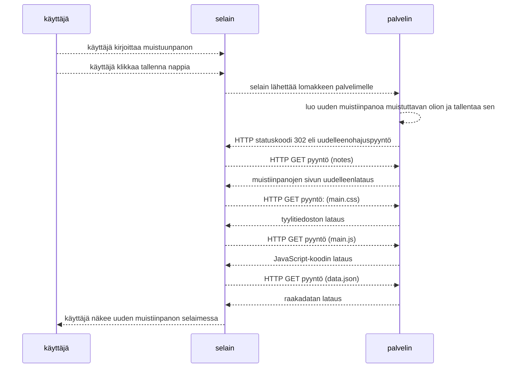

```mermaid
sequenceDiagram


    participant käyttäjä
    participant selain
    participant palvelin

    käyttäjä-->>selain: käyttäjä kirjoittaa muistuunpanon
    käyttäjä-->>selain: käyttäjä klikkaa tallenna nappia
    selain -->> palvelin: selain lähettää lomakkeen palvelimelle
    palvelin -->> palvelin: luo uuden muistiinpanoa muistuttavan olion ja tallentaa sen
    palvelin -->> selain: HTTP statuskoodi 302 eli uudelleenohajuspyyntö
    selain -->> palvelin: HTTP GET pyyntö (notes)
    palvelin -->> selain: muistiinpanojen sivun uudelleenlataus
    selain -->> palvelin: HTTP GET pyyntö: (main.css)
    palvelin -->> selain: tyylitiedoston lataus
    selain -->> palvelin: HTTP GET pyyntö (main.js)
    palvelin -->> selain: JavaScript-koodin lataus
    selain -->> palvelin: HTTP GET pyyntö (data.json)
    palvelin -->> selain: raakadatan lataus
    selain -->> käyttäjä: käyttäjä näkee uuden muistiinpanon selaimessa

```
