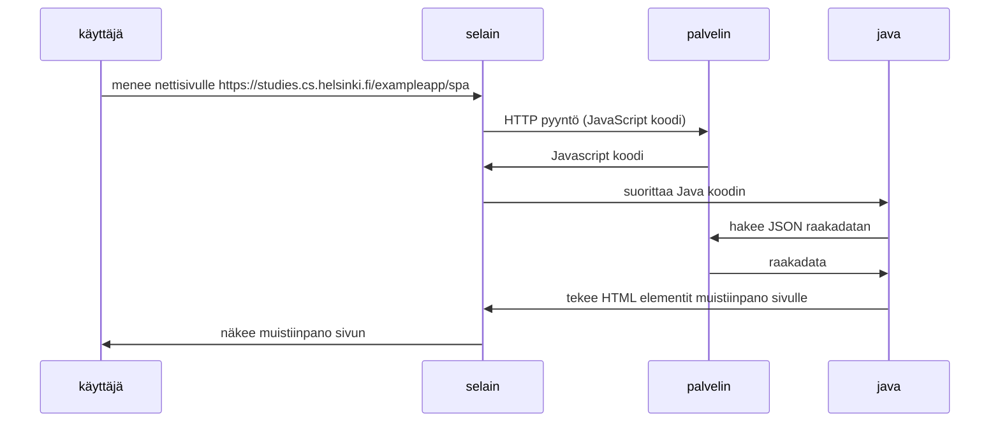

```mermaid
    sequenceDiagram

    participant käyttäjä
    participant selain
    participant palvelin
    participant java

    käyttäjä ->> selain: menee nettisivulle https://studies.cs.helsinki.fi/exampleapp/spa
    selain ->> palvelin: HTTP pyyntö (JavaScript koodi)
    palvelin ->> selain: Javascript koodi

    selain ->> java: suorittaa Java koodin
    java ->> palvelin: hakee JSON raakadatan
    palvelin ->> java: raakadata
    java ->> selain: tekee HTML elementit muistiinpano sivulle
    selain ->> käyttäjä: näkee muistiinpano sivun


```
