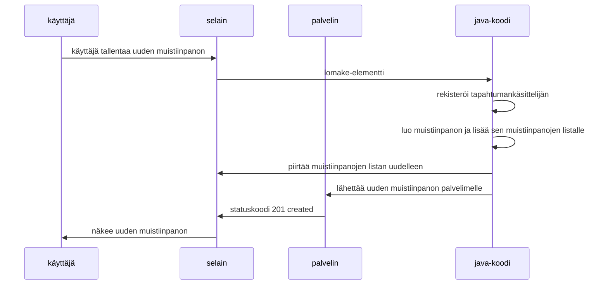

```mermaid
sequenceDiagram
    participant käyttäjä
    participant selain
    participant palvelin
    participant java-koodi

    käyttäjä ->> selain: käyttäjä tallentaa uuden muistiinpanon
    selain ->> java-koodi: lomake-elementti
    java-koodi->> java-koodi: rekisteröi tapahtumankäsittelijän
    java-koodi ->> java-koodi: luo muistiinpanon ja lisää sen muistiinpanojen listalle
    java-koodi ->> selain: piirtää muistiinpanojen listan uudelleen
    java-koodi ->> palvelin: lähettää uuden muistiinpanon palvelimelle
    palvelin ->> selain: statuskoodi 201 created
    selain->> käyttäjä: näkee uuden muistiinpanon

```
